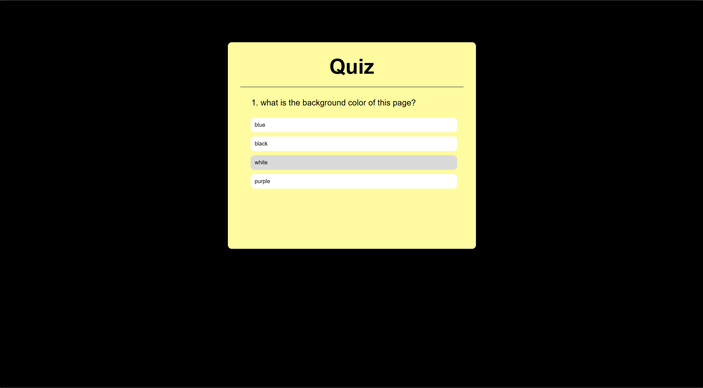

# 🧠 Quiz Web App (JavaScript)

An interactive **Quiz Web Application** built using **HTML, CSS, and Vanilla JavaScript**.  
Users can answer multiple-choice questions, receive **instant feedback**, and view their **final score** at the end.

This project focuses on **DOM manipulation**, **event handling**, and **dynamic UI updates** using JavaScript.

---

## 📸 Preview

---

## 🚀 Features

- Dynamic question loading
- Multiple-choice answers
- Instant feedback (correct / incorrect highlighting)
- Score tracking
- Restart quiz option
- Clean and responsive UI
- Pure JavaScript (no libraries or frameworks)

---

## 🛠️ Tech Stack

- **HTML5** – Structure  
- **CSS3** – Styling & layout  
- **JavaScript (ES6)** – Logic, DOM manipulation, and interactivity  

---

## 📂 Folder Structure

'''
# 🧠 Quiz Web App (JavaScript)

An interactive **Quiz Web Application** built using **HTML, CSS, and Vanilla JavaScript**.  
Users can answer multiple-choice questions, receive **instant feedback**, and view their **final score** at the end.

This project focuses on **DOM manipulation**, **event handling**, and **dynamic UI updates** using JavaScript.

---

## 📸 Preview

---

## 🚀 Features

- Dynamic question loading
- Multiple-choice answers
- Instant feedback (correct / incorrect highlighting)
- Score tracking
- Restart quiz option
- Clean and responsive UI
- Pure JavaScript (no libraries or frameworks)

---

## 🛠️ Tech Stack

- **HTML5** – Structure  
- **CSS3** – Styling & layout  
- **JavaScript (ES6)** – Logic, DOM manipulation, and interactivity  

---

## 📂 Folder Structure

'''
│
├── index.html # Main HTML file
├── style.css # Styling for the app
├── app.js # Quiz logic and functionality
├── quiz.png # App screenshot
└── README.md # Project documentation
'''

---

## ⚙️ How It Works

1. Questions are stored as JavaScript objects.
2. JavaScript dynamically renders:
   - Questions
   - Answer buttons
3. User selection:
   - Highlights correct and incorrect answers
   - Disables other options
4. Score is updated in real time.
5. At the end:
   - Final score is displayed
   - User can restart the quiz.

---

## 📌 Learning Outcomes

Through this project, I learned:

- DOM manipulation using JavaScript
- Event listeners and user interaction handling
- Dynamic element creation
- Conditional rendering
- State management using variables
- Basic UI/UX design principles

---

